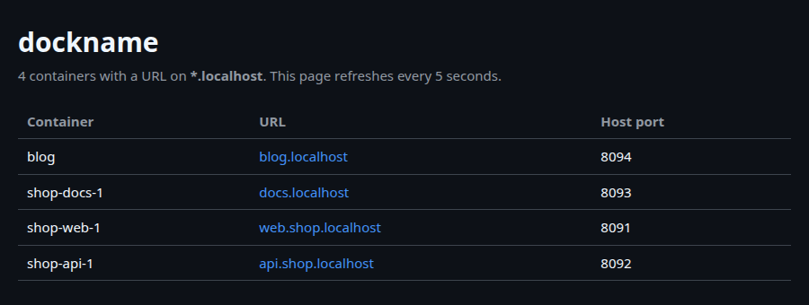
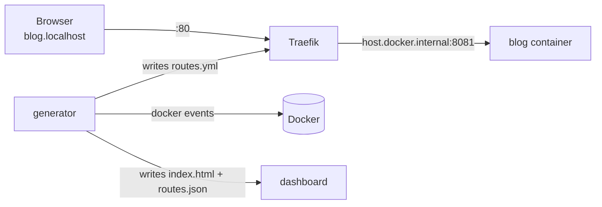

<div align="center">

# dockname

**Every Docker container gets a `name.localhost` URL. Zero labels, zero config.**

Stop memorizing ports. `localhost:8081`, `localhost:3002` and `localhost:8093` become
`blog.localhost`, `api.shop.localhost` and `docs.localhost`, automatically, the moment a container starts.

[](https://github.com/hugoamadio/dockname/actions/workflows/ci.yml)
[](LICENSE)




</div>

## Why

You run a dozen containers while developing: the app, its API, an admin, a branch you are reviewing,
a second copy of the same app for another ticket. Each one sits on some port you have to remember,
bookmark, or look up with `docker ps`.

Reverse proxies solve this, but they want work from you: a label or environment variable on every
container, and every container attached to the proxy's network. **dockname wants nothing.** It reads
the ports your containers already publish and names them after the container. Your compose files stay
untouched, and it works the same for `docker run`, Compose, devcontainers and tools that start
containers for you.

## Quick start

```bash
git clone https://github.com/hugoamadio/dockname.git
cd dockname
docker compose up -d
```

That's it. Start anything with a published port:

```bash
docker run -d --name blog -p 8081:80 nginx
```

and open **<http://blog.localhost>**. Open **<http://dockname.localhost>** to see every URL.

dockname restarts with Docker, so this is a one-time setup.

> Port 80 already taken? `DOCKNAME_HTTP_PORT=8080 docker compose up -d` and use `http://blog.localhost:8080`.

## How names are chosen

| Container | URL |
| --- | --- |
| `docker run --name blog -p 8081:80 nginx` | `blog.localhost` |
| Compose service `api` in project `shop` (`shop-api-1`) | `api.shop.localhost` |
| Second replica `shop-api-2` | `api-2.shop.localhost` |
| Compose with a custom `container_name: shop_admin` | `shop-admin.localhost` and `admin.shop.localhost` |
| Label `dockname.host=docs` | `docs.localhost` |
| Label `dockname.host=docs,manual.localhost` | both |

Names are lowercased and anything outside `a-z 0-9 -` becomes `-`. If two containers want the same
name, the first one keeps it.

**Which port?** When a container publishes several, dockname picks the one mapped to container port
`80`, then `8080 3000 8000 5173 4200 5000 8888 9000`, then the first published TCP port. Force one
with the label `dockname.port=<container port>`.

**Skipped:** containers with no published TCP port, ports bound only to `127.0.0.1`, and anything
labelled `dockname.enable=false`.

Try it with the example stack:

```bash
docker compose -f examples/docker-compose.yml up -d
# http://web.shop.localhost  http://api.shop.localhost  http://docs.localhost
```

## Labels

All optional. dockname works without any of them.

```yaml
services:
  docs:
    image: nginx
    ports: ["8093:80", "9090:9090"]
    labels:
      dockname.host: docs, handbook   # docs.localhost and handbook.localhost
      dockname.port: "9090"           # route to container port 9090, not 80
      # dockname.enable: "false"      # no URL for this container
```

## Naming rules (no labels needed)

Some names follow a pattern you can't or don't want to label: one copy of an app per feature branch,
names a tool generates, a prefix you'd rather drop. Put `sed -E` rules in `rules.sed` (git ignores it)
next to `docker-compose.yml`. The first line a rule prints becomes the host:

```sed
# myapp-feat42 -> feat42.myapp.localhost   (one URL per branch)
s/^myapp-([a-z0-9]+)$/\1.myapp/p

# legacy-blog-1 -> blog.localhost
s/^legacy-([a-z]+)-[0-9]+$/\1/p
```

Then `docker restart dockname-generator`. Containers no rule matches keep their default names, and a
`dockname.host` label still wins over the rules. See [`rules.example.sed`](rules.example.sed).

## Configuration

Set these in your shell or in a `.env` file next to `docker-compose.yml`:

| Variable | Default | What it does |
| --- | --- | --- |
| `DOCKNAME_HTTP_PORT` | `80` | Port dockname listens on |
| `DOCKNAME_DOMAIN` | `localhost` | Domain appended to every name (e.g. `test` with your own DNS) |
| `DOCKNAME_PREFERRED_PORTS` | `80 8080 3000 8000 5173 4200 5000 8888 9000` | Container ports tried first |

## Scripts and editors

The list of routes is also published as JSON, for shell scripts, editor extensions and status bars:

```bash
curl -s http://dockname.localhost/routes.json
```

```json
[
  {"container": "blog", "hosts": ["blog.localhost"], "url": "http://blog.localhost/", "hostPort": 8081}
]
```

## How it works



Three tiny containers:

- **generator** (`docker:cli`, ~10 MB RAM) listens to `docker events`. On every container start, stop or
  rename it runs `docker ps`, turns the published ports into routes and writes a Traefik config file,
  only when something changed.
- **traefik** (~35 MB RAM) serves port 80 and forwards `name.localhost` to `host.docker.internal:<published port>`.
  Your containers never join its network, which is why nothing in your compose files changes.
- **index** (`busybox httpd`, ~1 MB RAM) serves the dashboard and `routes.json` at `dockname.localhost`.

Browsers resolve `*.localhost` to your own machine on their own ([RFC 6761](https://www.rfc-editor.org/rfc/rfc6761#section-6.3)),
so there is no DNS server to install and no `/etc/hosts` to edit.

The logic is one POSIX shell script, [`generator.sh`](generator.sh), with unit tests and an end-to-end
test in CI.

## FAQ

**Does it work on macOS, Windows and Linux?**
Yes: Docker Desktop on all three, and Docker Engine on Linux. `host.docker.internal` is mapped with
`host-gateway`, which Docker Engine supports since 20.10.

**`blog.localhost` doesn't resolve in my terminal.**
Chrome, Edge and Firefox resolve `*.localhost` by themselves, and so does `curl`. Some other tools and
OS resolvers don't: add `127.0.0.1 blog.localhost` to `/etc/hosts`, or run a local DNS such as dnsmasq
with `address=/localhost/127.0.0.1`.

**Do WebSockets and hot reload work?**
Yes. Traefik proxies WebSocket upgrades as-is, so Vite, webpack and Next.js hot reload keep working.

**What about HTTPS?**
Not yet: dockname serves plain HTTP. Browsers already treat `http://*.localhost` as a secure context,
so service workers, `crypto.subtle` and secure cookies work without a certificate.

**My container publishes its port on `127.0.0.1` only.**
dockname reaches containers through the Docker host gateway, which a `127.0.0.1` binding refuses on
Linux. Publish on all interfaces (`-p 8081:80`) for containers you want named.

**I get a 404.**
Open <http://dockname.localhost>: if the container isn't listed, check it is running and publishes a
TCP port (`docker ps`). `docker logs dockname-generator` shows how many routes were written.

## Uninstall

```bash
docker compose down -v
```

Nothing else was touched: no DNS, no `/etc/hosts`, no labels in your projects.

## Contributing

Issues and pull requests are welcome. Run the tests with `sh test/run.sh` (no Docker needed), and keep
`generator.sh` POSIX `sh`: it runs on BusyBox inside the `docker:cli` image.

If dockname saves you from one more `docker ps`, a ⭐ helps other developers find it.

## License

[MIT](LICENSE)
